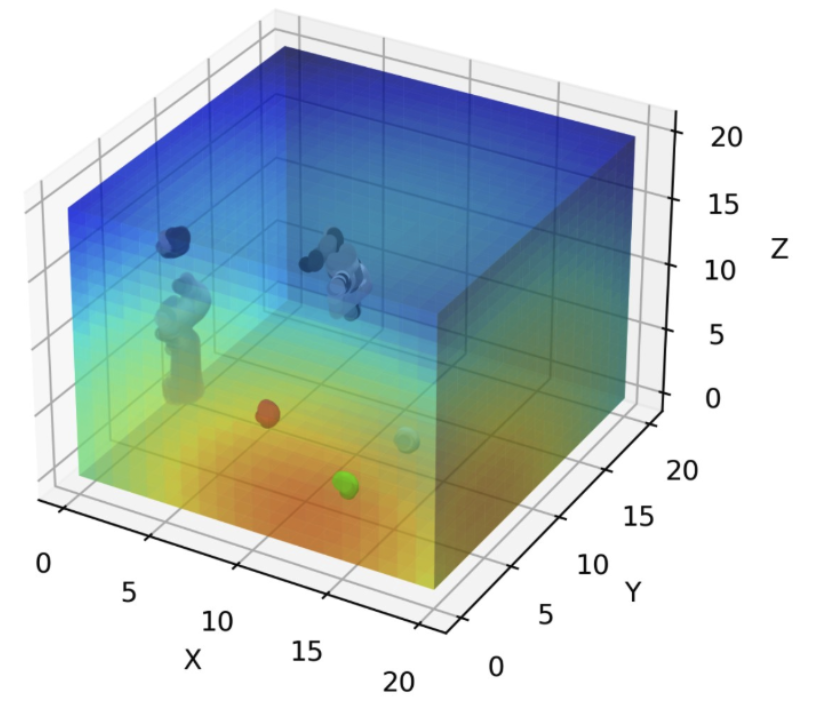

# RL-Final-Project-CMDE

This project introduces a novel exploration-driven strategy for reinforcement learning by leveraging a pre-computed CostMap generated by VoxPoser, LLM and VLM. It enables agents to efficiently explore sparse and complex environments, reducing sample complexity without relying on rewards or demonstrations.

<p align="center">
  
</p>

The exploration video can be watch at: https://www.youtube.com/playlist?list=PLY1ajVcSz0Bd9-WvQ4dMtA8WpEYkZNZHg

## Setup
```
pip3 install torch torchvision torchaudio
pip install gym PyOpenGL matplotlib numpy wheel setuptools gymnasium imageio[ffmpeg] moviepy

git clone https://github.com/stepjam/PyRep.git .local/PyRep
cd .local/PyRep
pip install .
cd ../..

git clone https://github.com/stepjam/RLBench.git .local/RLBench
cd .local/RLBench
pip install .
cd ../..
```

## Costmap Generation

### Task Environment
We use the task `reach_target` in RLBench as task environment. To fix the costmap, we set the seed for environent scene generation to be the same as the demo `variation=2, episode=9`

### CostMap Generation
We utilize the previously developed work, VoxPoser (https://voxposer.github.io), to generate the cost maps for our approach. The seed for scene generation is set to be the same as our training environment. 

In VoxPoser, the LLM and VLM generate the target map and avoidance map, which indicate regions of interest and regions to be avoided, respectively. In both maps, lower values correspond to areas that the agent should approach more closely, with the target map emphasizing regions to be prioritized and the avoidance map highlighting areas to be avoided. In our experiment, we leverage target map as the cost map for action guidance, and direct the agent towards regions that are deemed more favorable for task completion.

### CostMap Generation Steps
1. Clone Voxposer repo, or use docker version. Docker version steps: https://hackmd.io/@khtu/rJBH0YvfJl

2. In `playground.ipynb`, load `reach_target` task:
    ```
    env.load_task(tasks.ReachTarget)
    ```

3. Add `reach_target` into `envs/task_object_names.json`:
    ```
    "reach_target": [["target", "target"]]
    ```

4. Copy `reach_target/` directory into Voxposer (if you use docker version, run `sudo docker cp ./reach_target/ <docker-id>:/root/workspace/VoxPoser/src`), and fix the seed before task environment reset by modifying the followings in `envs/rlbench_env.py`.
    ```
    import pickle

    # in reset() in line 220, before task reset in line 229
    self.task.set_variation(2)
    existing_demo = pickle.load(open('/root/workspace/VoxPoser/src/reach_target/variation2/episodes/episode9/low_dim_obs.pkl', 'rb'))
    random_seed_state = existing_demo.random_seed
    np.random.set_state(random_seed_state)

    task.reset_to_demo(demo)

    ```
5. Save the `target_map` in `interfaces.py`:
    ```
    # in line 119
    path_voxel, planner_info = self._planner.optimize(start_pos, _affordance_map, _avoidance_map, object_centric=object_centric)
        
    # Add the followings
    target_map = planner_info['target_map']
    np.save('cost_map_var2.npy', target_map)
    ```

6. Execute `playground.ipynb`, the `cost_map_var2.npy` should be saved in current directory.


## Start Training
Environment setup
```
# Only need to run once
Xorg -noreset -config ./xorg.conf :99 &

# Need to set the DISPLAY every time when starting a new Terminal.
export DISPLAY=:99
```

Start training
```
# Run Baseline
python ppo_baseline.py

# Run CostMap-Driven Exploration
python ppo_action.py

# Run CostMap-Driven Reward
python ppo_costmap_reward.py
```
